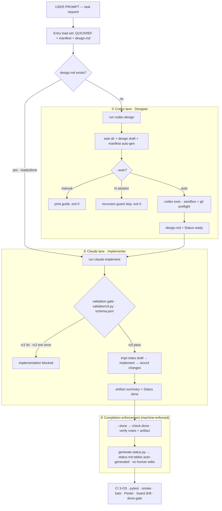

# Codex-With-Claude

> English | **[한국어](./README.md)**

A collaborative workspace where Codex designs and Claude implements.

## Overview

This repository creates a repeatable **Codex (Designer) → Claude (Implementer)** workflow.

- Codex writes a design in `design.md`
- Claude reads that document and implements accordingly
- Incomplete design documents are automatically blocked from implementation

## Workflow

From the user prompt, the lanes that **Codex (Designer)** and **Claude (Implementer)** each traverse. Full write-up: [kb/concepts/workflow.md](./kb/concepts/workflow.md).



Defensive lines throughout: `--auto` failure propagates non-zero · recursion guard (`CLAUDECODE`) · context budget `context-budget.py` (warning) · `design.md` is Codex-owned (Claude does not edit it).

## Structure

```
├── QUICKREF.md                # Quick operating reference (routine entry point)
├── AGENT.md                   # Shared agent protocol + state transitions (SoT)
├── CLAUDE.md                  # Claude operating rules
├── collab.md                  # Review loop interface/enum/gate SoT (v2 active)
├── UPDATING.md                # How to pull updated CWC into an existing clone
├── kb/                        # Knowledge base (local markdown vault)
│   ├── index/                 # status.md (generated board), table of contents
│   ├── concepts/              # Architecture, workflow
│   ├── tasks/<task-id>/       # design.md · implementation-notes.md · manifest.md
│   └── artifacts/             # Output summaries
├── runtime/                   # Scripts + validator/tools (Bash · PowerShell · Python)
│   ├── codex-design.{sh,ps1}      # Request Codex design + manifest auto-gen + validation
│   ├── claude-implement.{sh,ps1}  # Design validation + implement guide + --done gate
│   ├── validator/                 # design.md validation SoT (schema.json + Python)
│   ├── lib/                       # python probe · session detect · invoke-codex/claude
│   ├── context-budget.py          # Context budget warning (warning-only)
│   ├── generate-status.py         # status.md board auto-gen + --check drift
│   └── README.md                  # External CLI contract + exit-code spec
├── templates/                 # design · implementation-notes · artifact · manifest templates
└── tests/                     # pytest(validator·context_budget·status_board) + bats + pester + smoke
```

## Usage

### Step 1: Request design from Codex

```powershell
# PowerShell
./runtime/codex-design.ps1 task-004 "Design user auth module"

# Bash
./runtime/codex-design.sh task-004 "Design user auth module"
```

> A `manifest.md` is auto-generated for each new task. Pass `--auto` to invoke Codex automatically.

### Step 2: Request implementation from Claude

```powershell
# PowerShell
./runtime/claude-implement.ps1 task-004

# Bash
./runtime/claude-implement.sh task-004
```

### Step 3: Completion check (after implementation, optional)

```powershell
# PowerShell
./runtime/claude-implement.ps1 task-004 -Done

# Bash
./runtime/claude-implement.sh --done task-004
```

> done-gate: verifies `implementation-notes.md` and `kb/artifacts/<id>-summary.md` are filled.
> When a task completes, `python3 runtime/generate-status.py` refreshes the `kb/index/status.md` board automatically (CI checks for drift).

## Design Document Validation

Both `claude-implement` and `codex-design` perform identical validation. The single source of truth for checks and blocking conditions is [`runtime/validator/schema.json`](./runtime/validator/schema.json); a human-readable summary lives in [QUICKREF.md](./QUICKREF.md) under "검증 게이트".

## Document State Transitions

Design readiness (design.md) and implementation progress (implementation-notes.md) are **separated into two layers**. The single source of truth for the state model is [AGENT.md](./AGENT.md) "Document State Transitions".

## Environment

- **Windows**: PowerShell `.ps1` scripts (UTF-8 BOM, calls `codex.cmd`)
- **macOS/Linux**: Bash `.sh` scripts
- **Knowledge base**: Local markdown files (viewable with Obsidian, etc.)

## Roadmap

- **v1 (current)**: Codex design → Claude implementation loop + validation gate · context budget · generated status board · done-gate
- **v2 (current)**: model/effort enforcement + prompt SSOT, optional design cross-review
  (`review-design`), Codex implementation-review loop via `collab.md` (`codex-review`) + approved-done gate.
- **v2+ (deferred)**: external backend adapters (Notion, etc.) — adopt when a second backend is actually required.

## Updating an existing clone

To pull the updated framework into a directory you already cloned and work in **without losing your work**,
follow [UPDATING.md](./UPDATING.md). You can also tell that directory's AI agent to "read UPDATING.md and
perform the update" (the doc ends with an agent-oriented procedure).

## License

MIT
