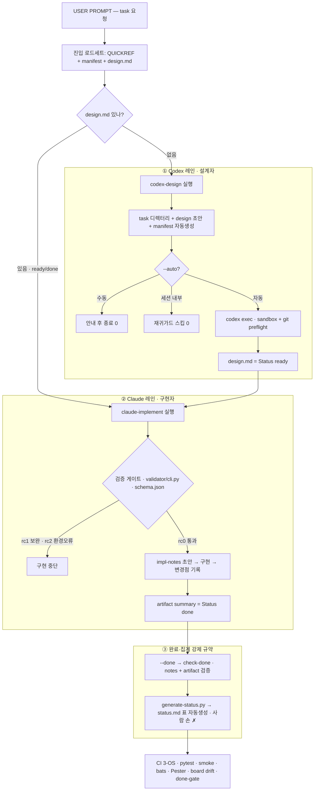
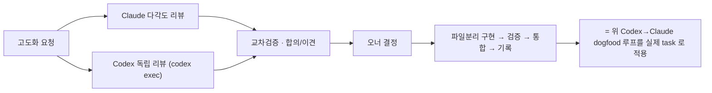

# 협업 워크플로우 — Codex 레인 / Claude 레인

> Load: on-demand
> 사용자 프롬프트 입력 순간부터 **Codex(설계자)** 와 **Claude(구현자)** 가 각각 거치는 흐름과,
> 그 사이의 검증 게이트·강제 규약(machine-enforced)을 한 장으로 정리한다.
> 관련: [architecture.md](./architecture.md) · 상태 모델 정본 [AGENT.md](../../AGENT.md) "문서 상태 전이" · 러너/CLI 계약 [runtime/README.md](../../runtime/README.md).

## 전체 흐름

## ① Codex 레인 (설계자)

`runtime/codex-design.{sh,ps1} <id> "<설명>"`

1. `kb/tasks/<id>/` 디렉터리와 `design.md` 초안(템플릿)을 만든다.
2. `manifest.md` 를 자동생성한다(Phase A — 기본 로드세트 최소화).
3. 호출 모드 분기:
   - **수동**(기본): 안내만 출력하고 종료 `0`.
   - **세션 내부 + `--auto`**: 재귀가드가 막아 종료 `0`(`*_AUTO_FORCE=1` 로만 우회).
   - **`--auto`**: `codex exec --sandbox workspace-write`(+ git preflight)로 Codex가 설계를 채운다. CLI 부재/실패는 **non-zero 전파**.
4. 완성된 `design.md` 의 `Status` 는 `ready`. **design.md 는 Codex 소유**이며 Claude 는 수정하지 않는다.

## ①.5 (선택) 설계 교차검토 — `review-design.{sh,ps1}` (task-005, P1)

Codex 설계가 validator 를 통과한 뒤, 구현을 시작하기 **전에** 선택적으로 실행할 수 있는 advisory 단계다.

1. `runtime/review-design.sh <id>` — validator 재통과를 precondition 으로 확인한 뒤 Claude
   `design.claude_cross_check`(fable-5/max + fallback opus-4-8, `--output-format json`)로 **읽기전용** 2차 검토.
2. 결과는 `kb/tasks/<id>/design-review.md`(advisory)에 기록, manifest 에 `cross_reviewed_by` provenance.
3. **게이트가 아니다**: 우려가 있어도 종료코드 0. `claude-implement` 의 validator 게이트/ done-gate 의미는 바꾸지 않는다.
4. design.md 는 읽기전용(전후 SHA-256 해시 비교), fallback 발동은 조용히 넘기지 않고 provenance 에 명시.

## ② Claude 레인 (구현자)

`runtime/claude-implement.{sh,ps1} <id>`

1. **검증 게이트** `validator/cli.py` (규칙 단일원천 = `schema.json`):
   - `rc0` 통과 → 진행 / `rc1` 설계 보완요청·중단 / `rc2` 환경오류·중단.
   - `Status` 가 `ready|done` 이 아니면 **구현 거부**(방어).
2. `implementation-notes.md` 초안 생성 → Claude 가 구현.
3. 설계와 달라진 결정은 `implementation-notes.md` 에 기록.
4. `kb/artifacts/<id>-summary.md`(`Status: done`) 작성.

## ③ 완료·집계 강제 규약 (machine-enforced)

사람이 문서를 손대지 않아도 정확히 유지되도록 강제한다.

- **done-gate** `cli.py --check-done <id>` (러너 `--done`/`-Done`): 완료를 주장하는 task 가 `implementation-notes.md`(채움) + `artifacts/<id>-summary.md`(필수 필드)를 실제로 갖췄는지 검사. `task-001` 은 규약 이전 산출물이라 legacy 예외.
- **status board 생성** `generate-status.py`: 각 task 의 Status 에서 `kb/index/status.md` 의 활성/완료 표를 결정론적으로 생성(마커 블록만). CI `--check` 가 drift 를 차단 → 손 갱신/불일치 불가.

## ④ (선택) 구현 리뷰 루프 — `codex-review.{sh,ps1}` (task-006, Phase D)

구현 완료(base done) 이후 **선택적으로** 실행하는 Codex 리뷰 단계다. 자동 트리거가 아니라 opt-in.

1. `runtime/codex-review.sh <id>` — `--check-review-target` 로 base done(impl-notes+summary+manifest)을
   확인한 뒤(리뷰 게이트 제외), Codex `review.codex`(gpt-5.5/xhigh)로 구현을 리뷰한다.
2. codex 는 staging 파일에 쓰고, `--check-review` 통과 시에만 `kb/tasks/<id>/reviews/<NNN>.md` 로 승격한다.
3. **approved-done**: `reviews/` 가 있으면 `--check-done` 은 최신 리뷰가 `approved` 일 때만 통과한다
   (없으면 기존 done-gate 동작 유지). **no-auto-revert**: 리뷰는 task status 를 자동으로 바꾸지 않는다.
4. enum/게이트 정본은 [collab.md](../../collab.md), 러너/CLI 계약은 [runtime/README.md](../../runtime/README.md).

## 방어선 (곳곳)

| 방어 | 위치 |
|------|------|
| 검증 규칙 단일원천 | `runtime/validator/schema.json` |
| `--auto` 실패 non-zero 전파 | `runtime/lib/invoke-*` + 러너 |
| 재귀가드(중첩 세션 차단) | `CLAUDECODE`/`CLAUDE_CODE_SESSION_ID`, `*_AUTO_FORCE=1` 우회 |
| codex 쓰기 표면 축소 | `--sandbox workspace-write` + git preflight |
| 컨텍스트 예산(경고) | `runtime/context-budget.py` |
| design.md 소유권 | Codex 소유, Claude 미수정 |

## (부록) 이 워크스페이스를 고도화할 때의 메타 흐름

구조 개선 작업 자체도 같은 협업 패턴을 따른다:

